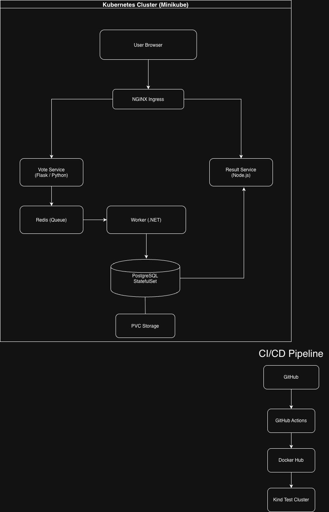

SquareOps DevOps Assignment
Overview

This repository contains my solution for the SquareOps DevOps assignment using the Example Voting Application.

The application consists of:

Vote Service (Flask/Python)
Redis Queue
Worker Service (.NET)
PostgreSQL
Result Service (Node.js)

The project was deployed on a local Minikube Kubernetes cluster and enhanced with persistence, health checks, ingress routing, and a CI/CD pipeline for the vote service.

Architecture

The application runs on a local Minikube Kubernetes cluster.

Users access the application through an NGINX Ingress resource. Votes submitted through the Flask frontend are pushed into Redis. The .NET worker consumes votes from Redis and stores them in PostgreSQL. The Node.js result service reads data from PostgreSQL and displays the current voting results.

The CI/CD pipeline uses GitHub Actions to lint, build, test, and validate changes made to the vote service.

Changes Made

Compared to the original manifests, I made the following changes:

PostgreSQL StatefulSet

The original PostgreSQL deployment was replaced with a StatefulSet. Since PostgreSQL is a stateful application, using a StatefulSet provides stable storage and predictable pod identity.

Persistent Storage

A PersistentVolumeClaim (PVC) was added to PostgreSQL so that vote data survives pod restarts.

I verified persistence by deleting the PostgreSQL pod and confirming that the data remained available after Kubernetes recreated it.

Kubernetes Secret

PostgreSQL credentials were moved into a Kubernetes Secret instead of being stored directly inside the manifest files.

Health Checks

Readiness and liveness probes were added to all workloads so Kubernetes can determine when containers are healthy and ready to receive traffic.

Resource Requests and Limits

CPU and memory requests/limits were added to improve scheduling and prevent resource contention.

NGINX Ingress

An Ingress resource was added for the vote and result applications instead of relying only on NodePort services.

CI/CD Pipeline

A GitHub Actions workflow was created for the vote service.

The pipeline:

Lints the vote service
Validates Kubernetes manifests
Builds a Docker image
Pushes the image to Docker Hub
Creates a temporary Kind cluster
Deploys the application
Runs a smoke test
Running the Application
Prerequisites
Docker
Minikube
kubectl
Deploy

Run:

./bootstrap.sh

The script starts Minikube, deploys all Kubernetes resources, waits for pods to become ready, and provides access instructions.

Verify

Check that all pods are running:

kubectl get pods

Check services:

kubectl get svc

Check ingress:

kubectl get ingress
Access the Application

Vote application:

minikube service vote --url

Result application:

minikube service result --url

Cast a vote and verify that the result page updates after a few seconds.

Troubleshooting
Pods Are Not Starting

Check pod status:

kubectl get pods

Inspect a pod:

kubectl describe pod <pod-name>

View logs:

kubectl logs <pod-name>
Votes Are Not Appearing In The Result Application

Check the worker logs:

kubectl logs deployment/worker

Verify Redis and PostgreSQL are healthy:

kubectl get pods

Since the worker is responsible for moving votes from Redis into PostgreSQL, this is usually the first place to investigate.

Ingress Is Not Accessible

Verify ingress resources:

kubectl get ingress

For Minikube, ensure ingress is enabled and run:

minikube tunnel
Trade-offs and Future Improvements
Trade-offs
I used Minikube because it provides a simple local Kubernetes environment that is easy to reproduce.
I kept the manifests as plain Kubernetes YAML instead of converting everything to Helm.
The CI/CD pipeline was implemented only for the vote service because that was the requirement.
Future Improvements

With more time I would:

Convert the manifests into a Helm chart
Add Prometheus and Grafana monitoring
Add integration tests
Add TLS support for ingress traffic
Add GitOps deployment using ArgoCD
Demo Video

Loom Recording:

ADD_LINK_HERE